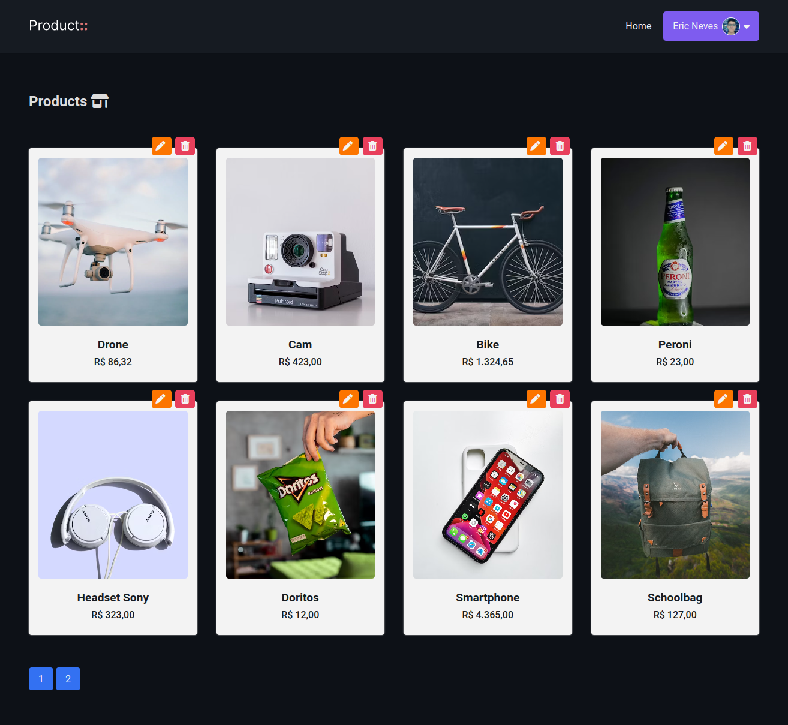

# CRUD MVC COM PHP
👨‍🏫APLICAÇÃO MVC COM PHP PURO - SIMPLES, RÁPIDO E PRÁTICO.

 <br> 
 <br> 

## DESCRIÇÃO:
A aplicação explora diversos recursos, como autenticação, permitir ações apenas ao usuário autenticado, rotas dinâmicas, segurança nas rotas, paginação, requisições assíncronas e muito mais.

## EXECUTANDO O PROJETO:
1. **Importar o `DATABASE.sql`**  
   - Antes de iniciar o site, é necessário importar o arquivo localizado em `./CODIGO/DATABASE.sql`.

2. **Configuração do PHP**  
   - Abra o arquivo `./CODIGO/config.php` e insira suas credenciais do banco de dados, além de ajustar o `BASE_URL` conforme necessário.

3. **Ativar o ModRewrite**  
   - Utilize o seguinte comando no terminal para ativar o ModRewrite: 

   ```bash
   a2enmod rewrite
   ```

   - Como alternativa, você pode habilitar o ModRewrite nas configurações do **Apache**.

4. **Executando o Aplicativo com Apache**  
   - Coloque os arquivos em um servidor web compatível com PHP, como XAMPP, WAMP ou LAMP.
   - Acesse o formulário no navegador visitando [http://localhost/CODIGO/index.php](http://localhost/CODIGO/index.php).

5. **Executando o Aplicativo com `php.exe`**  
   - Como alternativa, você pode iniciar o servidor diretamente no diretório `./CODIGO` utilizando o seguinte comando:

   ```bash
   php -S localhost:8080
   ```

   - Em seguida, acesse o formulário no navegador através do endereço: [http://localhost:8080](http://localhost:8080).

6. **Credenciais de Acesso**  
   - Para fazer login, utilize as seguintes credenciais:

   ```sh
   $ email: ericneves@email.com
   $ senha: admin
   ```

## NÃO SABE?
- Entendemos que para manipular arquivos em `HTML`, `CSS` e outras linguagens relacionadas, é necessário possuir conhecimento nessas áreas. Para auxiliar nesse aprendizado, oferecemos cursos gratuitos disponíveis:
* [CURSO DE HTML E CSS](https://github.com/VILHALVA/CURSO-DE-HTML-E-CSS)
* [CURSO DE PHP](https://github.com/VILHALVA/CURSO-DE-PHP)
* [CURSO DE JAVASCRIPT](https://github.com/VILHALVA/CURSO-DE-JAVASCRIPT)
* [CURSO DE MYSQL](https://github.com/VILHALVA/CURSO-DE-MYSQL)
* [CURSO DE PHP COM MYSQL](https://github.com/VILHALVA/CURSO-DE-PHP-COM-MYSQL)
* [CONFIRA MAIS CURSOS](https://github.com/VILHALVA?tab=repositories&q=+topic:CURSO)

## CREDITOS:
- [PROJETO CRIADO PELO "EricNeves"](https://github.com/EricNeves/simpleCRUDMVC)
- [VEJA O VIDEO DESSE PROJETO](https://youtu.be/jamKWbvmerQ?si=Qgm1hxWr-SQ810mx)
- [PROJETO CRIADO PELO VILHALVA](https://github.com/VILHALVA)


